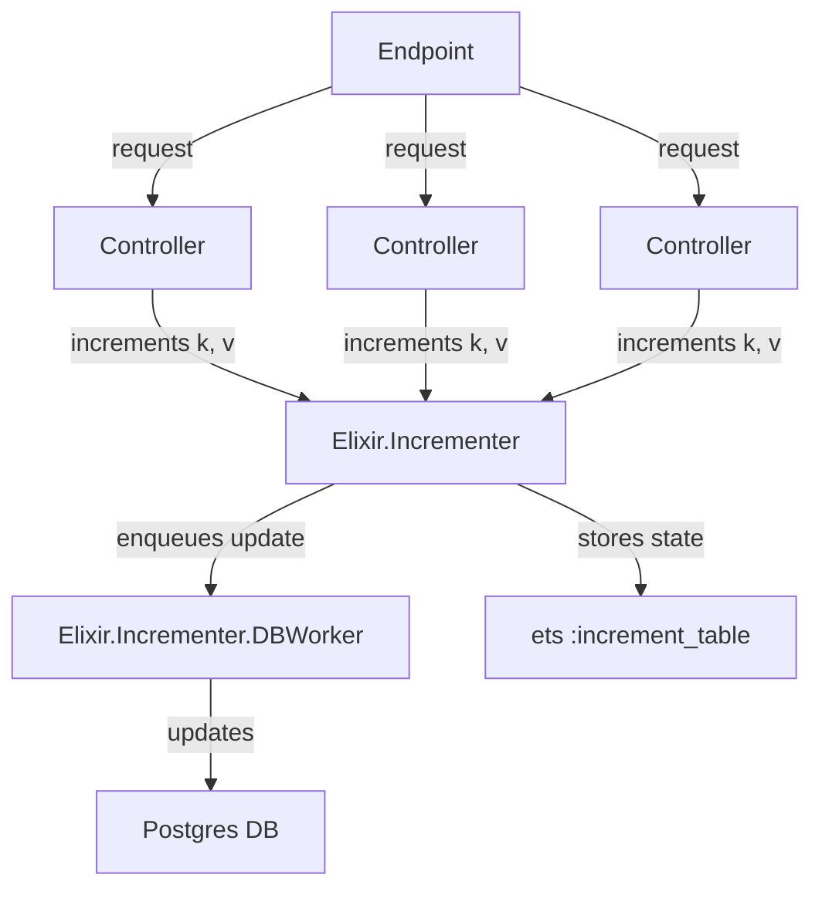
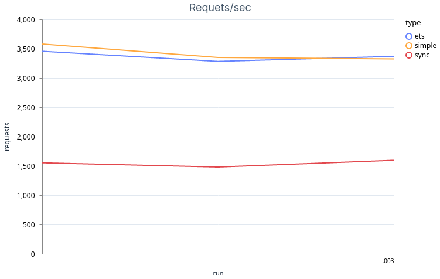
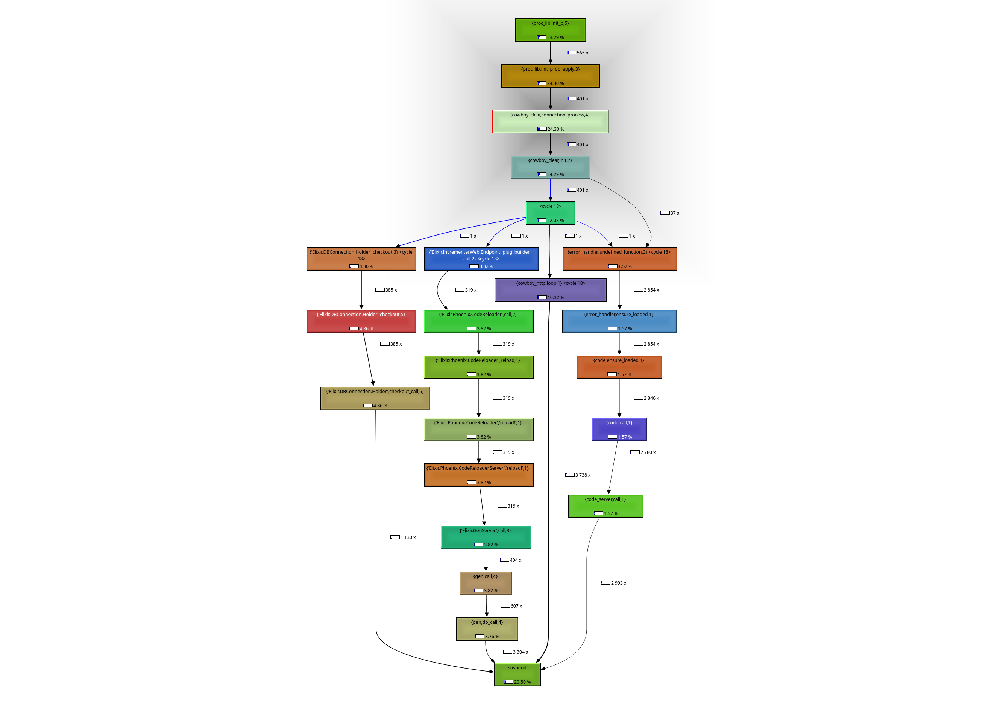

<!-- livebook:{"persist_outputs":true} -->

# Appcues Tech challenge

```elixir
Mix.install([
  {:kino_vega_lite, "~> 0.1.1"}
])
```

<!-- livebook:{"output":true} -->

```
:ok
```

## Setup

To start your Phoenix server:

* Install dependencies with `mix deps.get`
* Make sure a postgres db is running on the port `5432` and that the `postgres` user exists and has the same password.
* Create and migrate your database with `mix ecto.setup`
* Run tests with `mix test`
* Start Phoenix endpoint with `mix phx.server` or inside IEx with `iex -S mix phx.server`

Now you can start posting to [`localhost:3333/increment`](http://localhost:4000).

## Architecture

The proposed approach makes use of a `ets` table as the main `<key, value>` storage making use 
of `:ets.update_counter/4` to update and increment the given key by the value amount, this logic is handled by the `Elixir.Incrementer` module, at the same time an update event is enqueued for insertion into the database.

These update events are then batched and inserted by the `Elixir.Incrementer.DBWorker` module when a threshold of events is reach or after a polling event. When the application is started the ets table will be populated with the values found in the   postgres db.

<!-- livebook:{"break_markdown":true} -->

<!-- Learn more at https://mermaid-js.github.io/mermaid -->



<!-- livebook:{"break_markdown":true} -->

The threshold and polling time configuration can be found in the `config.ex` file, default values are.

<!-- livebook:{"force_markdown":true} -->

```elixir
config :incrementer, Incrementer.DBWorker,
  max_updates: 10_000,
  polling_time: 5_000
```

<!-- livebook:{"break_markdown":true} -->

Both  `Elixir.Incrementer.DBWorker` and  `Elixir.Incrementer` are GenServers the reason for this is to allow async casts in order to respond the incomming request ASAP without waiting for the increment operation to finish, protect their own ets table making sure only their owner can access it and beeing supervised by the application in case of a crash.

## Limitations

Working with ETS tables is easy and straightforward but the tables are only available to one node, from experience when a web server goes to production several identical instances are launched in parallel, this solution can't be used like that because each intance will have their own ets table working in isolation causing out of sync values when the same key is sent to different instances. A solution to this can be the use of mnesia.

Metrics and Error handling is basic at best if the db worker crashes with a out of sync queue, those updates will not be inserted to the db.

## Performance

In order to test the effectivnes of the proposed approach I benchmarked the number of request per seccond that the server can handle. It's compared to  other two different approaches: a baseline elixir phoenix server that does nothing and always return 202 labeled as  **simple** in the data below, a synchronous solution that first gets the value from the postgres db, increments and then updates the new value immediately this approach is labeled as **sync**, and finally the proposed solution is labeled as **ets**

Data was collected from three runs using [WRK](https://github.com/wg/wrk) as the http load tool with the following parameters: `wrk -c 400 -t 16 -d 30s -s priv/scripts/post.lua http://localhost:3333/increment`, the script that generates the body request can be found inside the project in the file: `priv/scripts/post.lua` it generates a random key and random integer and post it to our server in the expected format.

All the runs were made in the same machine a ryzen9 5950x with 64gb of ram.



```elixir
results = [
  requests: [3456, 3283, 3369] ++ [3581, 3351, 3326] ++ [1553, 1480, 1596],
  run: [1, 2, 3, 1, 2, 3, 1, 2, 3],
  type: [:ets, :ets, :ets, :simple, :simple, :simple, :sync, :sync, :sync]
]
```

<!-- livebook:{"output":true} -->

```
[
  requests: [3456, 3283, 3369, 3581, 3351, 3326, 1553, 1480, 1596],
  run: [1, 2, 3, 1, 2, 3, 1, 2, 3],
  type: [:ets, :ets, :ets, :simple, :simple, :simple, :sync, :sync, :sync]
]
```

<!-- livebook:{"attrs":{"chart_title":"Requets/sec","height":400,"layers":[{"chart_type":"line","color_field":"type","color_field_aggregate":null,"color_field_type":null,"data_variable":"results","x_field":"run","x_field_aggregate":null,"x_field_type":"temporal","y_field":"requests","y_field_aggregate":null,"y_field_type":"quantitative"}],"vl_alias":"Elixir.VegaLite","width":600},"kind":"Elixir.KinoVegaLite.ChartCell","livebook_object":"smart_cell"} -->

```elixir
VegaLite.new(width: 600, height: 400, title: "Requets/sec")
|> VegaLite.data_from_values(results, only: ["run", "requests", "type"])
|> VegaLite.mark(:line)
|> VegaLite.encode_field(:x, "run", type: :temporal)
|> VegaLite.encode_field(:y, "requests", type: :quantitative)
|> VegaLite.encode_field(:color, "type")
```

<!-- livebook:{"output":true} -->

```vega-lite
{"$schema":"https://vega.github.io/schema/vega-lite/v5.json","data":{"values":[{"requests":3456,"run":1,"type":"ets"},{"requests":3283,"run":2,"type":"ets"},{"requests":3369,"run":3,"type":"ets"},{"requests":3581,"run":1,"type":"simple"},{"requests":3351,"run":2,"type":"simple"},{"requests":3326,"run":3,"type":"simple"},{"requests":1553,"run":1,"type":"sync"},{"requests":1480,"run":2,"type":"sync"},{"requests":1596,"run":3,"type":"sync"}]},"encoding":{"color":{"field":"type"},"x":{"field":"run","type":"temporal"},"y":{"field":"requests","type":"quantitative"}},"height":400,"mark":"line","title":"Requets/sec","width":600}
```

As the graph shows the proposed solution and the baseline project are very close, this is the result of priorizing the response time and using ets as a memory cache and batch insertion to the postgres db. It also shows that it's considerable better than the sync approach.

This can be seen in the profiling result showing that most of the time the code is executing the phoenix framework.

## Conclusions

I enjoyed this excerise and learnt a about GenServers and ets, given more time I would like to explore horizontal scaling making sure this service can work with several intances running at the same time.
